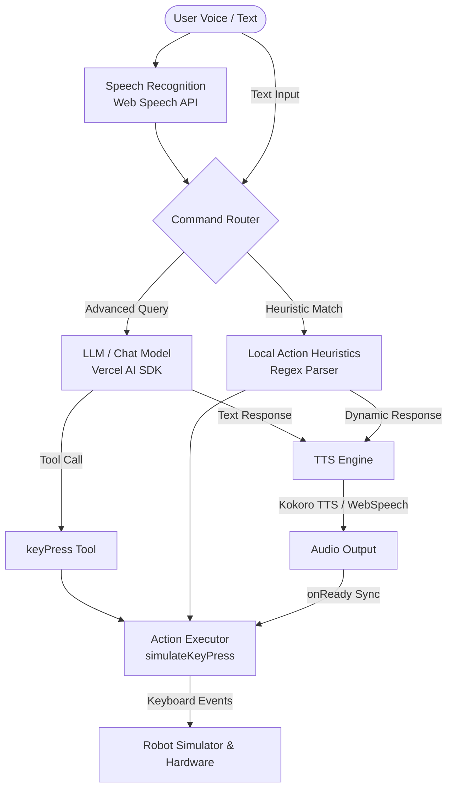

<a href="https://bambot.org">
  
</a>

<br/>
<br/>

<p align="center">
  <a href="https://discord.gg/Fq2gvSMyRJ"></a>
  <a href="https://i.v2ex.co/1U6OSqswl.jpeg"></a>
  <a href="https://x.com/tim_qian"></a>
  <a href="https://deepwiki.com/timqian/bambot"></a>
</p>

# [Bambot](https://bambot.org)

Play with open-source, low-cost AI robots 🤖

Bambot makes it easy to simulate, control, and build your own low-cost robots. The project integrates a 3D simulation environment, an AI-powered control interface, and direct WebUSB-based hardware communication.

---

## 🌟 Key Features

- **3D Robot Playground**: Interactive simulation using Three.js/React Three Fiber to visualize and test robot movements in the browser.
- **AI-Powered Controls & Speech**: Control the robot using natural language via an integrated LLM chat panel (supports local options like **Ollama** phi3:latest). The robot features high-quality, human-like voice synthesis directly in the browser (using local **Kokoro-82M TTS**) that executes concurrently with synchronized physical movements.
- **WebUSB Direct Control (`feetech.js`)**: Connect and send commands directly from Chrome/Edge to Feetech servos (STS/SCS series) without installing external drivers.
- **Low-Cost Hardware**: Standard designs combining the SO-100 arm and LeKiwi omni-directional base, costing ~ $300 in total.

---

## 📂 Project Structure

This repository is organized as a monorepo containing the following components:

- **[`website/`](file:///d:/bambot/website)**: A Next.js web application providing the interactive 3D playground, keyboard/AI control interfaces, and robot assembly steps.
- **[`feetech.js/`](file:///d:/bambot/feetech.js)**: A lightweight WebUSB SDK/library for controlling Feetech servos (like the STS3215) directly from the browser.
- **[`hardware/`](file:///d:/bambot/hardware)**: Bill of Materials (BOM), 3D printable STL/3MF models, and assembly resources.

---

## 🚀 Getting Started

### 1. Run the Web Interface Locally

To spin up the interactive website on your local machine:

```bash
cd website
pnpm install
pnpm run dev
```

Open [http://localhost:3000](http://localhost:3000) to view it in your browser.

### 2. Using the Feetech JS SDK

You can use `feetech.js` in your own web applications to control servos over WebUSB:

```bash
cd feetech.js
npm install
```

```javascript
import { ScsServoSDK } from "feetech.js";
const scsServoSdk = new ScsServoSDK();

// Request USB device permission and connect
await scsServoSdk.connect();

// Read current servo position
const position = await scsServoSdk.readPosition(1);
console.log(`Servo 1 Position: ${position}`);
```

For more API details, refer to the [SDK Documentation](https://deepwiki.com/timqian/bambot/5.1-sdk-overview-and-api).

---

## 🎙️ Speech & AI Control Architecture

Bambot integrates interactive speech recognition, natural language reasoning, high-fidelity speech synthesis, and keyboard-event emulation to control both simulated and physical robots.



### 1. Speech Recognition (STT)
* **API**: Browser-native Web Speech API (`SpeechRecognition` / `webkitSpeechRecognition`).
* **Implementation**: The mic button in the chat control activates standard voice capture in English (`en-US`), feeding the parsed transcript directly into the command routing pipeline.

### 2. Command Interpretation & Action Routing
When a command is received, it follows one of two paths:
* **Local Heuristic Match**: Quick regex parsing identifies simple movement keywords (e.g., *left, right, up, down, forward, backward, open, close*) along with durations (e.g., *2 seconds*, *500ms*). If matched, it generates a predefined dynamic conversational acknowledgment.
* **Advanced AI Interpretation**: Falls back to the Vercel AI SDK, utilizing OpenAI-compatible endpoints (configured for NVIDIA Nemotron-voicechat by default, or customizable to Ollama). It leverages a dedicated `keyPress` tool (defined with Zod parameters for `key` and `duration`) that the LLM invokes to execute actions.

### 3. Text-to-Speech (TTS)
To deliver conversational feedback, the system cleans markdown from the output and speaks via:
* **Kokoro-82M TTS (Primary)**: A high-quality local model run client-side using `kokoro-js` with WebAssembly/ONNX Runtime Web. It generates raw audio buffers dynamically in the browser (voice: `af_heart`) and plays them via the Web Audio API.
* **Web Speech Synthesis (Fallback)**: Native browser `window.speechSynthesis` using `SpeechSynthesisUtterance`.

### 4. Action Execution & Outputs
* **Simulated Keyboard Interaction**: Movements are executed by generating standard `KeyboardEvent` instances (`keydown` and `keyup`) dispatched to the browser's `window` context. These virtual keys are intercepted by the 3D playground simulation or physical WebUSB handlers to actuate the robot.
* **Synchronized Actions**: To mimic realistic behavior, movement execution is held until the audio output triggers its `onReady` (Kokoro) or `onstart` (Web Speech API) callback. This synchronizes the physical robot's movement exactly with its voice synthesis.
* **System Output**: 
  1. **Textual**: Rendered messages within the chat panel interface.
  2. **Auditory**: Synthesized voice response played through the system speakers.
  3. **Physical/Simulated**: Real-time 3D model animations in the Three.js viewport and/or direct servo commands via WebUSB.

---

## 🛠️ Hardware & Assembly

For details on the 3D printed parts, electronic components, and full assembly instructions, check out the **[Hardware Guide](file:///d:/bambot/hardware/README.md)**.

---

## 📹 Demo Video

<a href="https://x.com/Tim_Qian/status/1901952877243122014">
  
</a>
